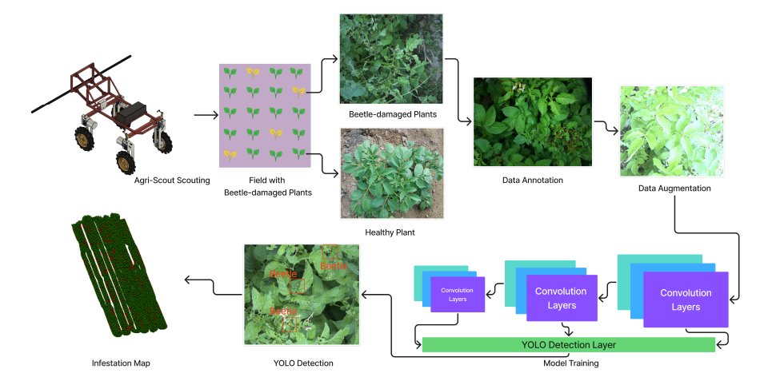
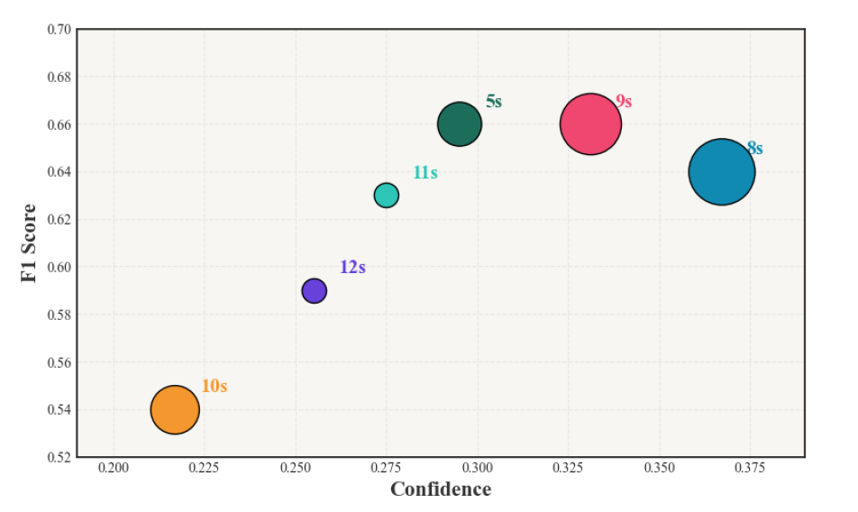

# Deep Learning Driven Edge Inference for Pest Detection in Potato Crops Using the AgriScout Robot

<div align="center">



[](https://www.python.org/)
[](https://pytorch.org/)
[](https://ultralytics.com/)
[](LICENSE)

</div>

---

## 🚀 Overview

This repository contains the implementation and evaluation of deep learning models for real-time pest detection in potato crops, specifically optimized for edge inference on the AgriScout robot. The project compares various YOLO architectures to find the optimal balance between accuracy and latency for field deployment.

## 📥 Data & Weights

- **Trained Model Weights:** [Download from Google Drive](https://drive.google.com/drive/folders/11pgYOwI2JvhArmhCEP6eWZRKStDOUWNG?usp=sharing)
- **Subset Dataset:** [Download from Google Drive](https://drive.google.com/drive/folders/16nKYBllKBIP34m2wgGFrXMrHCi6wg1dj?usp=sharing)

## 💻 Installation

1. **Clone the repository:**
   ```bash
   git clone https://github.com/yourusername/AgriScout-Beetle-Detection.git
   cd AgriScout-Beetle-Detection
   ```

2. **Install dependencies:**
   ```bash
   pip install -r requirements.txt
   ```

## 🏋️ Training

To start the training process for the various YOLO models (v5s, v8s, v9s, v10s, v11s, v12s), use the provided training script. This script is configured with optimized hyperparameters and augmentation settings for agricultural datasets.

```bash
python Scripts/Train.py
```

- **Configuration:** Edit [Scripts/Train.py](Scripts/Train.py) to modify `MODELS_TO_TEST`, `epochs`, or `imgsz`.
- **Output:** Results are saved in [runs/train_comparison/](runs/train_comparison/).

## 📊 Evaluation

To evaluate the trained models on the test set and generate comprehensive performance metrics (mAP50, mAP50-95, Precision, Recall), run:

```bash
python Scripts/Eval.py
```

This script performs multiple evaluation runs with different seeds to ensure statistical robustness.



## 🤖 Edge Inference (Jetson Orin Nano Super)

For deployment on the **NVIDIA Jetson Orin Nano Super** (JetPack 6), we utilize the official Ultralytics Docker environment to ensure optimized TensorRT performance.

### Setup Environment

```bash
# Define the image tag
t=ultralytics/ultralytics:latest-jetson-jetpack6

# Pull and run the container with NVIDIA runtime
sudo docker pull $t && sudo docker run -it --ipc=host --runtime=nvidia $t
```

### Run Benchmarks

Once inside the container, execute the inference script to measure latency and throughput:

```bash
python Scripts/Inference.py
```

## 📁 Project Structure

- [data/](data/): Dataset configuration and image/label directories.
- [Scripts/](Scripts/): Core execution scripts for training, evaluation, and inference.
- [Weights/](Weights/): Pre-trained and fine-tuned model weights.

---

*This work is part of the research on automated pest management using the AgriScout robotic platform.*
